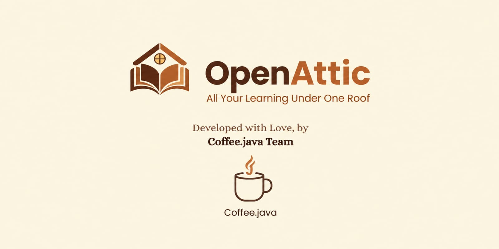
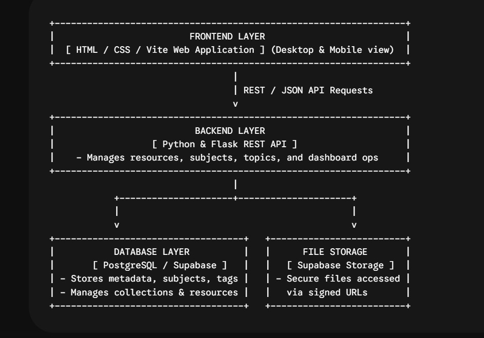

# DEFINE 4.0

The official project submission repository for **DEFINE 4.0 — The World's Realest Hackathon**.

---

# OpenAttic

<!-- Add your project cover image below -->



## Team Information

- **Team Name**:Coffee.java
- **Track**:Design

## Team Members

| Name | Role | GitHub | LinkedIn |
|------|------|--------|----------|
| Abhedh Krishnan JR | Leader | [@username](https://github.com/krizxjr) | [Profile](https://linkedin.com/in/abhedh-krishnan-j-r-b64a81381) |
| Arathy Krishna AM | Member | [@username](https://github.com/arathy-2007) | [Profile](https://linkedin.com/in/arathykrishnaam) |
| Eshan MS | Member | [@username](https://github.com/eshanms) | [Profile](https://linkedin.com/in/eshan-ms-462802390) |
| Gokul Viswa P | Member | [@username](https://github.com/xbox-one-x-guy) | [Profile](https://linkedin.com/in/gokul-viswa-p-863a58381) |
| S Aswini Devi | Member | [@username](https://github.com/aswiniidevi) | [Profile](https://linkedin.com/in/aswini-devi-3b66b23ab) |

---

# Project Details

## Overview

Students frequently waste valuable time hunting for study materials scattered across random platforms, folders, and browser tabs. OpenAttic solves this by providing a centralised dashboard that brings notes, textbooks, videos, and code repositories together in one unified place. This allows students to effortlessly organise their resources by subject and instantly discover everything they need for their studies.

## Problem Statement

Notes, PDFs, YouTube videos, GitHub repositories, previous-year questions, and textbooks are often scattered across different platforms, making it difficult for students to find, organise, and use the right study resources.

### What is the problem?

Study resources (lecture notes, PDFs, YouTube tutorials, GitHub repos, PYQs, textbooks) are fragmented across random platforms, cloud folders, and chats, making them a nightmare to track down.

### Who is affected by it?

Students and peer study groups within our institution who need a reliable, shared repository of materials tailored to our curriculum.

### Why is solving it important?

It eliminates administrative friction, keeps every classmate on the same page, and ensures that institutional knowledge (like previous-year questions and notes) isn't lost in chat histories.

### Limitations of existing solutions:

Generic cloud folders or personal bookmarks don't scale across a college batch, lack structured topic tagging, and fail to handle multi-format media like embedded GitHub repos or YouTube timestamps in a single academic workspace.

## Solution

To fix the midnight panic of hunting through random WhatsApp groups and scattered Drive links, we built StudyHub. It acts as a single campus dashboard that consolidates PDFs, YouTube videos, GitHub repos, and notes into one searchable, subject-organized workspace so students can stop searching and start studying.

Describe the core idea, workflow, and key technologies used to build the solution.

---

# Demo

### Demo Video

[Watch Project Demo](https://www.youtube.com/watch?v=VIDEO_ID)

> Replace `VIDEO_ID` with your YouTube video ID.

### Screenshots

<!-- Add screenshots of your project here -->


---

# Live Project

[Visit Live Project](https://your-project-url.com/)

---

# Technical Implementation

## Technologies Used

| Category | Technologies |
|----------|--------------|
| **Frontend** | Technologies |
| **Backend** | Technologies |
| **Database** | Technologies |
| **APIs / Services** | Technologies |
| **AI / ML** | Technologies |
| **DevOps / Deployment** | Technologies |
| **Other Tools** | Technologies |

## System Architecture

<!-- Add your architecture diagram here -->



## Key Features

- Feature 1
- Feature 2
- Feature 3
- Feature 4
- Feature 5

---

# Setup Instructions

## Prerequisites

Make sure the following are installed before running the project:

- Requirement 1
- Requirement 2
- Requirement 3

## Installation

### 1. Clone the Repository

```bash
git clone <repository-url>
